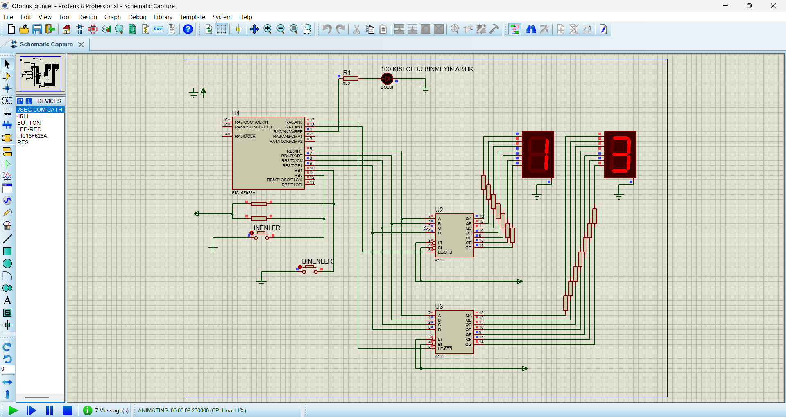

## 📷 Simulation

# pic16f628a-bus-passenger-counter
Bus passenger counter system using PIC16F628A (Assembly &amp; Proteus)

# PIC16F628A Bus Passenger Counter

## 📌 Project Description

This project is a bus passenger counter system developed using PIC16F628A microcontroller.

The system tracks passengers getting on and off the bus and controls the door based on capacity.

---

## ⚙️ Features

* Passenger count tracking
* Maximum capacity: 100 passengers
* Automatic door control
* Real-time display using 7-segment
* LED status indicators

---

## 🧠 Working Logic

* RA0 → Passenger boarding (+1)
* RA1 → Passenger leaving (-1)
* When passenger count reaches 100:

  * System triggers FULL state
  * Door closes automatically

---

## 🛠️ Technologies Used

* PIC16F628A
* Assembly (MPASM)
* Proteus

---

## ▶️ How to Run

1. Open Proteus project file
2. Load `.hex` file into PIC16F628A
3. Start simulation
4. Use buttons to simulate passengers

---

## 📁 Project Structure

* `code/` → Assembly code
* `proteus/` → Circuit design
* `hex/` → Compiled file

